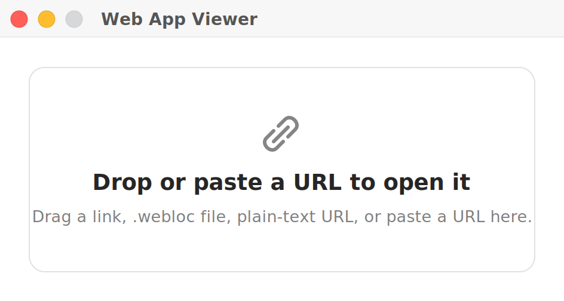
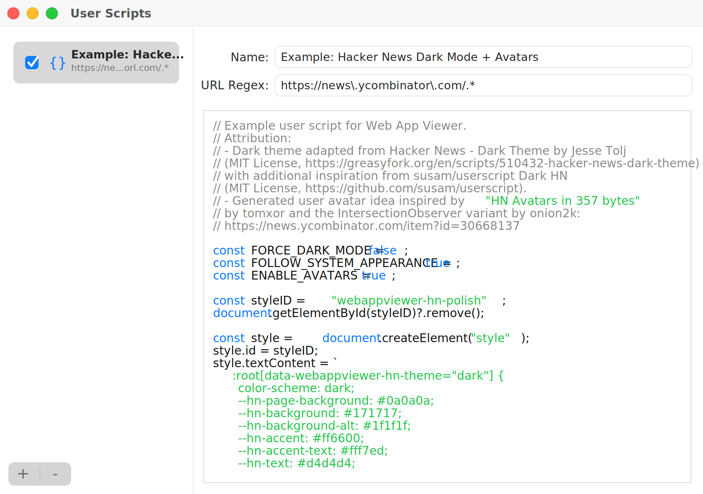

# Web App Viewer


A tiny native macOS shell for opening a specific website in WebKit windows without Safari's browser chrome.

This exists because Safari Web Apps still feel like they bring too much browser furniture along for the ride, especially in fullscreen. Web App Viewer is deliberately plain: one web page, one native window, as little visible chrome as macOS will reasonably allow.

## Behavior

- Opens `DefaultWebAppURL` from `Info.plist` on launch when configured.
- Shows a small drop/paste window on launch when no default URL is configured.
- Opens another window for the same web app with Command-N.
- Opens every supplied URL in a new window.
- Installs the current or entered URL as its own app in `~/Applications`, with a chance to rename it and pick from detected manifest or favicon images before saving.
- Lets you drop a custom image onto the installer icon preview to use it as the app icon.
- Uses an invisible draggable strip at the top of each window, starting just to the right of the traffic lights.
- Shows the traffic-light controls and scrollbars only while the pointer is over the window.
- Keeps same-origin links inside the web app, opens same-origin new-window links in another app window, and sends external links to Safari.
- Supports file downloads to `~/Downloads`.
- Supports foreground page notifications through the standard `Notification` API while the app is running.
- Supports per-URL user scripts from Preferences, with script names, URL regular expressions, and a JavaScript editor.
- Enables Web Inspector from the View menu, Option-Command-I, page context menus, or Safari's Develop menu.
- Provides standard macOS shortcuts for window close, reload, page zoom, edit actions, minimize, and quit.
- Accepts `.webloc`, `public.url`, and plain text URL drops on the Dock icon.
- Adds an "Open in Web App Viewer" macOS Service for selected URLs or URL-like text.
- Includes a macOS Share Extension that forwards shared URLs to a new app window.
- Registers the `webappviewer://open?url=...` URL scheme for integrations.

## Design Notes

The app is intentionally not a browser replacement. It has no address bar, tab strip, bookmark bar, toolbar, or Safari-style fullscreen frame. Pages open in separate windows, and the only hidden affordance is a narrow drag area at the top so the window can still be moved when the titlebar is visually suppressed.

More background is in [docs/background.md](docs/background.md).

## Screenshots





## Configure The Site

Edit `DefaultWebAppURL` in `Info.plist`:

```xml
<key>DefaultWebAppURL</key>
<string>https://your-site.example</string>
```

Leave it blank to choose a URL by dragging a link, `.webloc` file, or plain-text URL onto the startup window, or by pasting a URL into that window.

## Web Features

Web App Viewer is a focused wrapper, not a full browser. It supports normal in-page navigation, JavaScript, downloads, foreground notifications, user scripts, Web Inspector, and page zoom. It does not implement background Web Push, browser extensions, tabs, bookmarks, or a persistent address bar.

## User Scripts

Open Preferences to add JavaScript snippets that run at document start on matching pages. Enable or disable scripts from the script list; changes take effect on the next page reload. Each script has:

- a display name
- an activation checkbox in the script list
- a URL regular expression matched against the full page URL
- a JavaScript editor with syntax highlighting

Fresh preference stores include a disabled Hacker News appearance and generated-avatar example with source attribution and configuration constants in the script comments.

Generated web apps have their own bundle identifiers and preference stores, so configure user scripts inside the generated app you want to customize. Recreate or replace an existing generated app after installing a newer Web App Viewer build if you want that generated app to inherit newly added app features.

To debug a page or script, choose View > Show Web Inspector, press Option-Command-I, right-click the page and choose Inspect Element, or enable Safari's Develop menu and choose the matching Web App Viewer page from that menu. Embedded web views are inspectable.

## Build

```sh
make
```

The app bundle is created at:

```text
.build/WebAppViewer.app
```

## Run

```sh
make run
```

After building, macOS may need a moment to notice the Service and Share Extension entries. Logging out and back in, or opening System Settings > Keyboard > Keyboard Shortcuts > Services and Extensions > Sharing, usually refreshes them.

## Release

```sh
make release
```

Release archives are written to:

```text
dist/WebAppViewer.zip
```

Tagged releases are built by GitHub Actions and attached to GitHub Releases
with generated release notes. Local stable releases should be prepared with
`make bump-patch` or `make bump-minor`, committed, verified with `make release`,
tagged with `make tag-release`, and pushed with the tag.

> [!NOTE]
> Release builds are ad-hoc signed, not Developer ID signed or notarized. If
> macOS quarantines a downloaded build, only remove that quarantine bit for a
> build you trust:
>
> ```sh
> xattr -dr com.apple.quarantine /Applications/WebAppViewer.app
> ```

## License

MIT License. Copyright (c) 2026 Rui Carmo.
